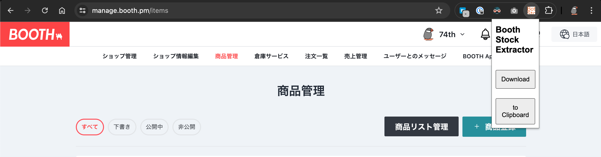

# Boothの商品管理ページから、在庫と販売数を抽出するChrome拡張機能



## インストール

chrome://extensions/ にて、"Developer mode"をOnにして、"Load unpacked"より[./dist/](./dist/)ディレクトリを読み込ませる。

## 使い方

Boothにログインし、商品管理ページを開く

https://manage.booth.pm/items

拡張機能をクリックし、"Download"、もしくは"to Clipboard"をクリック

```csv
Name,Variation,Sold,Stock
"SparrowDial : M5StackCore2、M5Dialをトラックパッドとして搭載可能なGH60互換ケース対応自作キーボードキット[74TH-G040]","",2,5
"USB 2.0 Type-C ソケット実装テスタ v2[74TH-G043]","",4,6
"ESP32-C3 IoT Serverキット（￥2,000）[74TH-G035]","キット（PCBとESP32C3を含む部品）[G035]",3,1
"ESP32-C3 IoT Serverキット（￥2,000）[74TH-G035]","3Dプリントケース・白[G035-CW]",3,1
```